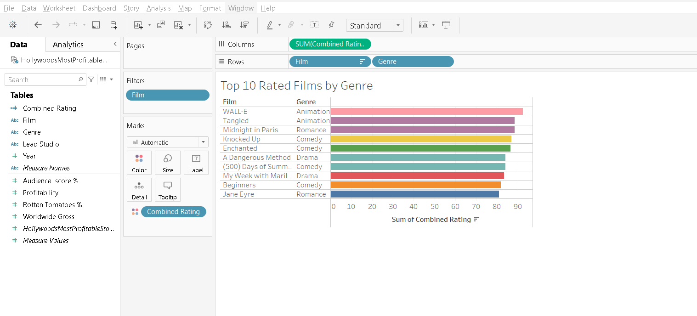
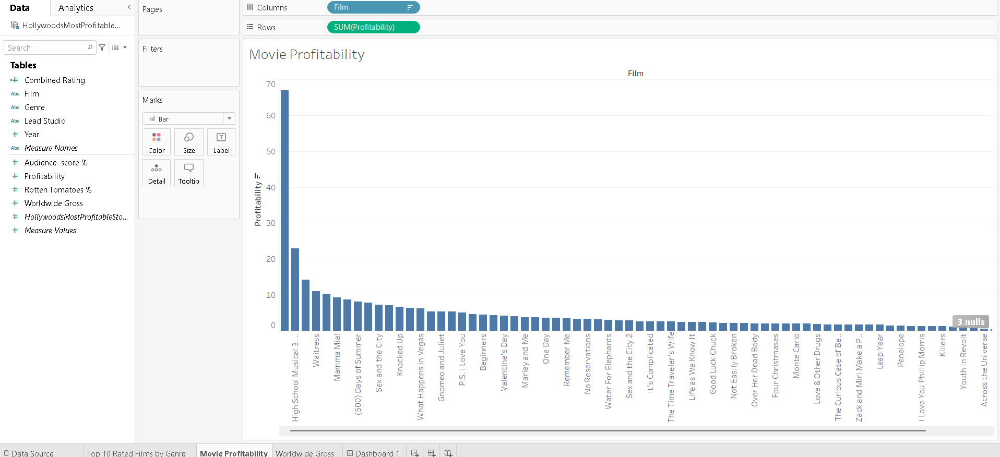
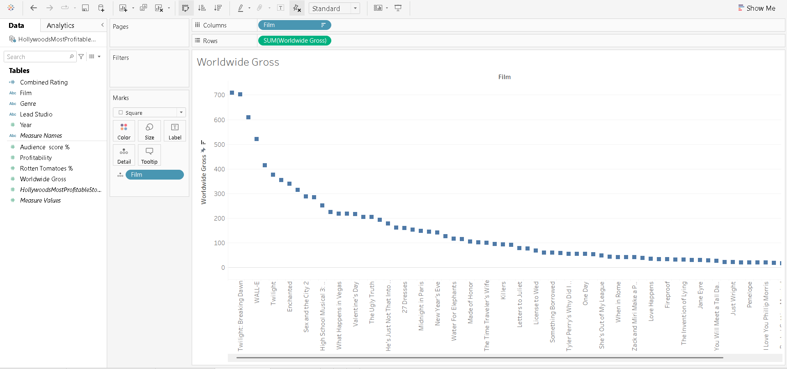

# 🎬 Hollywood's Most Profitable Stories - Tableau Dashboard

## 📊 Project Overview
This Tableau dashboard provides comprehensive analysis of 75 Hollywood movies, examining their profitability, audience reception, critical ratings, and worldwide box office performance. The visualization reveals interesting patterns about what makes movies successful across different genres and studios.

## 📁 Data Source
**File:** `HollywoodsMostProfitableStories.csv`

| Field | Description |
|-------|-------------|
| Film | Movie title |
| Genre | Genre category (Comedy, Drama, Romance, Animation, Fantasy, Action) |
| Lead Studio | Production/distribution studio |
| Audience score % | Audience rating percentage |
| Profitability | Profitability ratio (Gross/Budget) |
| Rotten Tomatoes % | Critic rating percentage |
| Worldwide Gross | Total worldwide earnings (in millions USD) |
| Year | Release year |

## 📈 Dashboard Visualizations

### 1. Top Rated Films by Genre
*Highest rated films based on combined audience and critic scores*



**Key Findings:**
- 🥇 **WALL-E** (Animation) leads with 92.5 combined rating
- 🥈 **Tangled** (Animation) follows with 88.5
- 🥉 **Midnight in Paris** (Romance) tops Romance genre with 88.5
- **Knocked Up** (Comedy) highest rated Comedy at 87

---

### 2. Movie Profitability
*Profitability ratio comparison across films*



**Key Findings:**
- 🔥 **Fireproof** shows exceptional profitability (66.93) - produced on minimal budget
- 🎭 **High School Musical 3** (22.91) demonstrates franchise power
- 🎵 **Mamma Mia!** (9.23) shows musical genre profitability
- 💰 Independent films can achieve higher profitability than studio blockbusters

---

### 3. Worldwide Gross
*Total worldwide earnings comparison*



**Key Findings:**
- 🌙 **The Twilight Saga: New Moon** leads with $709.82M
- 💔 **Twilight: Breaking Dawn** follows with $702.17M
- 🎤 **Mamma Mia!** third with $609.47M
- 🤖 **WALL-E** strong performance with $521.28M
- 🧛 **Twilight** series dominates top grossing positions

## 🔍 Key Insights

### By Genre
- **Animation** films receive highest combined ratings (avg 90+)
- **Comedy** is the most frequent genre (45+ films)
- **Romance** films show highest gross potential

### By Profitability
- Low-budget films like **Fireproof** can achieve 66x returns
- Franchise films (**Twilight**, **High School Musical**) ensure profitability
- Studio distribution impacts gross but not necessarily profitability

### By Studio Performance
- **Summit Entertainment** dominates with Twilight franchise
- **Disney** leads in Animation quality (WALL-E, Tangled)
- **Warner Bros.** most frequent distributor for Comedy genre

## 🛠️ Tools Used
- **Tableau Desktop** - Dashboard creation and visualization
- **CSV** - Data storage and management

## 📂 Repository Contents

```
hollywood-movies-tableau-dashboard/
│
├── README.md # Project documentation
├── HollywoodsMostProfitableStories.csv # Original dataset
├── Hollywood_Movie_Dashboard.twbx # Tableau workbook
│
└── screenshots/ # Dashboard images
├── top_rated_by_genre.png
├── movie_profitability.png
└── worldwide_gross.png
```


## 🚀 How to View the Dashboard

### Option 1: Tableau Desktop
1. Download `Hollywood_Movie_Dashboard.twb`
2. Open with Tableau Desktop (version 2020.1 or later)
3. Interact with filters and explore insights

### Option 2: Tableau Public (Free)
1. Create free account at [tableau.com/public](https://public.tableau.com)
2. Upload the .twbx file
3. Share the public link

## 📊 Dashboard Features
- **Interactive Filters** - Filter by year, genre, studio
- **Tooltips** - Hover for detailed information
- **Sorting** - Click columns to sort data
- **Cross-filtering** - Select on one sheet to highlight across all

## 💡 Future Improvements
- [ ] Add year-over-year trend analysis
- [ ] Include budget data for profitability calculation
- [ ] Create correlation analysis between critic and audience scores
- [ ] Add geographic distribution of worldwide gross
- [ ] Build predictive model for box office success

## 📝 Notes
- Profitability calculated as Worldwide Gross / Budget (where available)
- Some films missing data indicated by blank fields
- Data covers 2007-2011 period

## 🤝 Connect
- **Tableau Public:** https://public.tableau.com/views/HollywoodMovieDashboard_17744733111810/Top10RatedFilmsbyGenre?:language=en-US&:sid=&:redirect=auth&:display_count=n&:origin=viz_share_link
- **LinkedIn:** www.linkedin.com/in/karan-khankal-57a142204

## 📄 License
This project is for portfolio and demonstration purposes. Data is provided for educational use.

---

*Created with ❤️ using Tableau*
